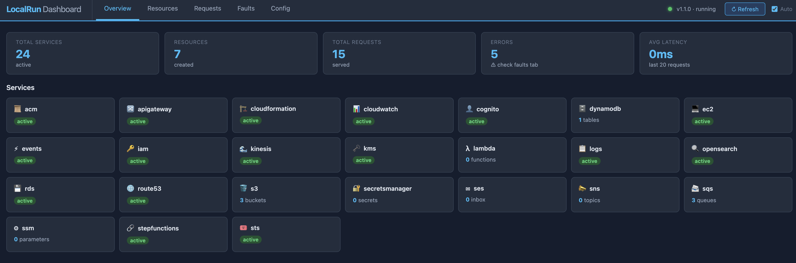

# LocalRun

**Run AWS services locally.** LocalRun is a lightweight, pure-Python AWS service emulator. It runs 24 AWS services on a single port with zero external dependencies — no Docker, no JVM, just `pip install` and go.

Built for developers who need fast, offline AWS testing without the overhead of full cloud emulators.



## Why LocalRun?

- **Zero setup** — `pip install` and run. No Docker required.
- **Single port** — all 24 services on `:4566`, just like production endpoint routing.
- **Drop-in compatible** — works with `boto3`, AWS CLI, and any AWS SDK. Just set `endpoint_url`.
- **Fast** — starts in under a second. In-memory storage, no cold starts.
- **Pure Python** — easy to extend, debug, and contribute to.
- **Web dashboard** — built-in visual UI at `/_localrun/ui`, free (no Pro tier needed).

## Supported Services

| Service | Operations |
|---------|-----------|
| **S3** | Buckets, objects, copy, multi-delete, list v2, range downloads, multipart upload, pagination, **event notifications** |
| **SQS** | Queues, messages, purge, attributes, batch send/delete/visibility, long polling, tags, **FIFO with deduplication** |
| **DynamoDB** | Tables, items, query, scan, batch ops, update expressions, transactions, TTL, **GSI**, **Streams** |
| **SNS** | Topics, subscriptions, publish, SNS→SQS fanout delivery |
| **Lambda** | Functions, invoke (sync + async), aliases, event source mappings, permissions, CloudWatch Logs, **hot reload** |
| **IAM** | Roles, policies, users, inline policies, instance profiles, groups, access keys |
| **CloudWatch Logs** | Log groups, streams, events, retention, tags, metric filters |
| **CloudWatch Metrics** | Put/get metrics, alarms, list metrics, set alarm state |
| **STS** | GetCallerIdentity, AssumeRole, GetSessionToken |
| **Secrets Manager** | Secrets CRUD, versioning, rotation, tags |
| **SSM Parameter Store** | Parameters CRUD, get-by-path, versioning, tags |
| **EventBridge** | Rules, targets, events, event buses, SQS/SNS/Lambda routing |
| **CloudFormation** | Stacks CRUD, **real resource provisioning** for S3/SQS/DynamoDB/IAM/Lambda/SNS/SSM + intrinsic fns |
| **RDS** | DB instances, clusters CRUD (stub) |
| **API Gateway** | REST APIs, resources, methods, integrations, deployments, stages, Lambda proxy |
| **OpenSearch** | Domains (control-plane), indices, documents, search, bulk, aggregations |
| **Kinesis** | Streams, shards, put/get records, shard iterators, list shards |
| **Step Functions** | State machines, executions, history, tags |
| **KMS** | Keys, aliases, encrypt/decrypt, GenerateDataKey, key policies, tags |
| **EC2** | Instances, VPCs, subnets, security groups, key pairs, volumes, AMIs |
| **ACM** | Certificates (request, describe, list, delete), tags |
| **Route53** | Hosted zones, record sets (A, CNAME, MX, etc.) |
| **SES** | Send email, verify identities, send quota, inbox inspection |
| **Cognito** | User pools, pool clients, users, sign-up, auth flows |

## Quick Start

```bash
# Install from PyPI
pip install aws-local-run

# Start the emulator
aws-local-run start
```

LocalRun is now running at `http://localhost:4566`.

## Using LocalRun in an Existing Project

Point any existing AWS project at LocalRun by overriding the endpoint URL. No code changes to your business logic required.

### Step 1: Start LocalRun

```bash
aws-local-run start
```

### Step 2: Configure your app

**Option A — Environment variables (recommended for existing projects):**

```bash
export AWS_ENDPOINT_URL=http://localhost:4566
export AWS_ACCESS_KEY_ID=test
export AWS_SECRET_ACCESS_KEY=test
export AWS_DEFAULT_REGION=us-east-1

# Now run your app as usual — all AWS calls route to LocalRun
python manage.py runserver
```

**Option B — boto3 configuration in code:**

```python
import boto3

session = boto3.Session(
    aws_access_key_id="test",
    aws_secret_access_key="test",
    region_name="us-east-1",
)

# Create clients with the LocalRun endpoint
s3 = session.client("s3", endpoint_url="http://localhost:4566")
sqs = session.client("sqs", endpoint_url="http://localhost:4566")
dynamodb = session.client("dynamodb", endpoint_url="http://localhost:4566")
```

**Option C — AWS CLI:**

```bash
aws --endpoint-url http://localhost:4566 s3 ls
aws --endpoint-url http://localhost:4566 sqs list-queues
aws --endpoint-url http://localhost:4566 sts get-caller-identity
```

### Example: Flask App with S3 + SQS

```python
import boto3, os

ENDPOINT = os.environ.get("AWS_ENDPOINT_URL", "http://localhost:4566")

s3 = boto3.client("s3", endpoint_url=ENDPOINT,
                  aws_access_key_id="test", aws_secret_access_key="test",
                  region_name="us-east-1")
sqs = boto3.client("sqs", endpoint_url=ENDPOINT,
                   aws_access_key_id="test", aws_secret_access_key="test",
                   region_name="us-east-1")

# Setup
s3.create_bucket(Bucket="uploads")
queue_url = sqs.create_queue(QueueName="jobs")["QueueUrl"]

# Upload a file and enqueue a processing job
s3.put_object(Bucket="uploads", Key="report.pdf", Body=open("report.pdf", "rb"))
sqs.send_message(QueueUrl=queue_url, MessageBody='{"file": "report.pdf", "action": "process"}')

# Worker: poll for jobs
messages = sqs.receive_message(QueueUrl=queue_url)
for msg in messages.get("Messages", []):
    print(f"Processing: {msg['Body']}")
    sqs.delete_message(QueueUrl=queue_url, ReceiptHandle=msg["ReceiptHandle"])
```

### Example: pytest Integration

```python
# conftest.py
import pytest, subprocess, time, requests

@pytest.fixture(scope="session", autouse=True)
def localrun():
    proc = subprocess.Popen(["aws-local-run", "start", "--port", "4566"])
    for _ in range(20):
        try:
            if requests.get("http://localhost:4566/health", timeout=1).ok:
                break
        except Exception:
            time.sleep(0.2)
    yield
    proc.terminate()

@pytest.fixture
def s3():
    import boto3
    return boto3.client("s3", endpoint_url="http://localhost:4566",
                        aws_access_key_id="test", aws_secret_access_key="test",
                        region_name="us-east-1")
```

```python
# test_uploads.py
def test_upload_and_download(s3):
    s3.create_bucket(Bucket="test-bucket")
    s3.put_object(Bucket="test-bucket", Key="file.txt", Body=b"hello")
    resp = s3.get_object(Bucket="test-bucket", Key="file.txt")
    assert resp["Body"].read() == b"hello"
```

## CLI

```bash
aws-local-run start                      # Start server
aws-local-run start --port 5000          # Custom port
aws-local-run start --services s3,sqs    # Only specific services
aws-local-run start --debug              # Debug logging
aws-local-run start --seed seed.json     # Pre-create resources from file
aws-local-run start --watch /path/to/fn  # Enable Lambda hot reload for a directory
aws-local-run status                     # Check if running
aws-local-run services                   # List all services
aws-local-run resources                  # List all created resources
aws-local-run resources --service s3     # Filter by service
aws-local-run export                     # Export state as CloudFormation JSON
aws-local-run wait                       # Wait until server is ready
aws-local-run wait --timeout 60          # Custom timeout (seconds)
aws-local-run doctor                     # Diagnose connectivity and config
aws-local-run doctor --port 4566         # Check a specific port
aws-local-run fault list                 # List active fault injections
aws-local-run fault add --service s3 --action GetObject --type error --status 500
aws-local-run fault add --service sqs --action ReceiveMessage --type latency --delay 2000
aws-local-run fault clear                # Remove all faults
aws-local-run fault clear --id <uuid>    # Remove a specific fault
aws-local-run terraform-config           # Print Terraform provider block
aws-local-run terraform-init             # Write localrun.tf and run terraform init
```

### Seed File

Pre-create resources at startup with a JSON seed file:

```json
{
  "s3": {"buckets": ["my-bucket", "my-other-bucket"]},
  "sqs": {"queues": ["jobs", "jobs-dlq"]},
  "dynamodb": {
    "tables": [
      {"name": "users", "key": "id", "type": "S"},
      {"name": "orders", "key": "order_id", "type": "S"}
    ]
  },
  "ssm": {
    "parameters": [
      {"name": "/app/db_url", "value": "postgres://localhost/mydb"},
      {"name": "/app/secret_key", "value": "dev-secret"}
    ]
  }
}
```

```bash
aws-local-run start --seed ./seed.json
```

### Wait for Ready

Useful in CI pipelines and Docker entrypoints:

```bash
aws-local-run start &
aws-local-run wait --timeout 30
# Server is ready, run tests now
```

### Doctor Command

Diagnose your LocalRun setup — checks connectivity, service health, and environment:

```bash
aws-local-run doctor
```

Output:
```
LocalRun Doctor

  [OK] Server running at localhost:4566 (version 1.2.0)
  [OK] Request log endpoint available

  Services:
    [OK] s3                   running
    [OK] sqs                  running
    ...

  Environment:
    [OK] AWS_ENDPOINT_URL=http://localhost:4566
    [OK] AWS_ACCESS_KEY_ID=test
    [OK] AWS_SECRET_ACCESS_KEY=test
    [OK] AWS_DEFAULT_REGION=us-east-1
```

### Config File

Instead of flags, configure LocalRun via `localrun.yaml` or `localrun.json` in the current directory:

```yaml
# localrun.yaml
port: 4566
region: us-east-1
services:
  - s3
  - sqs
  - dynamodb
  - lambda
debug: false
```

```bash
aws-local-run start  # auto-discovers localrun.yaml
```

### Lambda Hot Reload

Point `--watch` at a directory of Lambda function code. LocalRun polls for file changes and automatically re-zips and reloads any functions whose source was modified — no restart required:

```bash
aws-local-run start --watch ./src/functions
```

Any Lambda function whose `Handler` path is inside the watched directory is reloaded within a second of a file change. Great for iterative Lambda development.

## Fault Injection

LocalRun has a built-in fault injection API for chaos testing. Faults can inject errors or latency into specific service actions.

```bash
# Inject a 500 error on S3 GetObject (50% of the time)
aws-local-run fault add --service s3 --action GetObject --type error --status 500 --probability 0.5

# Inject 2 second latency on SQS receive
aws-local-run fault add --service sqs --action ReceiveMessage --type latency --delay 2000

# List active faults
aws-local-run fault list

# Remove a fault by ID
aws-local-run fault clear --id <uuid>

# Remove all faults
aws-local-run fault clear
```

You can also manage faults via HTTP:

```bash
# Add a fault
curl -X POST http://localhost:4566/_localrun/faults \
  -H "Content-Type: application/json" \
  -d '{"service": "s3", "action": "GetObject", "type": "error", "status": 500, "probability": 0.5}'

# List faults
curl http://localhost:4566/_localrun/faults

# Remove a fault
curl -X DELETE "http://localhost:4566/_localrun/faults/<id>"
```

## State Persistence

LocalRun can save and restore all in-memory state so you don't have to re-create resources after restart.

Set `LOCALRUN_DATA_DIR` to a directory and state is automatically saved/loaded:

```bash
LOCALRUN_DATA_DIR=/tmp/localrun-state aws-local-run start
```

Or use the HTTP API to save/load on demand:

```bash
# Save state
curl -X POST http://localhost:4566/_localrun/state/save

# Load state
curl -X POST http://localhost:4566/_localrun/state/load
```

### Named Snapshots

You can save and restore named snapshots to switch between different setups:

```bash
# Save the current state as "baseline"
curl -X POST http://localhost:4566/_localrun/state/save/baseline

# Restore it later
curl -X POST http://localhost:4566/_localrun/state/load/baseline

# See what snapshots are available
curl http://localhost:4566/_localrun/state/snapshots
```

State is stored as JSON (`localrun_state.json`) in `LOCALRUN_DATA_DIR`. Named snapshots are stored as `localrun_state_<name>.json`.

## Web Dashboard

LocalRun ships a built-in single-page web dashboard at:

```
http://localhost:4566/dashboard
```

No Pro tier, no Docker, no external dependencies — pure vanilla JS.


**Overview tab** — stats row (total services, resource count, request count, error count, avg latency) and service cards with icons. Each card shows live resource counts and expands on click to list individual resources (bucket names, queue names, table names, etc.).

**Resources tab** — filterable table of all created resources across all services. Filter by name or service. Click any row to expand the full JSON details.

**Requests tab** — live request log showing service, action, HTTP method, status code (color-coded), and duration. Filter by service, status class (2xx/4xx), or action name. Auto-refreshes every 4 seconds.

**Faults tab** — inject errors or latency into any service/action with configurable probability. Lists all active faults with delete buttons.

**Config tab** — server info, service list, and a live Terraform provider block you can copy-paste directly into your `.tf` files. Also has a "Reset All State" button for test isolation.

The header shows a green/red health indicator, server version, and a manual Refresh button alongside an Auto toggle.

## Request Log

LocalRun keeps a ring buffer of the last 200 requests for debugging:

```bash
# All recent requests
curl http://localhost:4566/_localrun/requests

# Filter by service
curl "http://localhost:4566/_localrun/requests?service=s3"

# Limit results
curl "http://localhost:4566/_localrun/requests?service=sqs&limit=10"
```

Each entry contains: `timestamp`, `method`, `path`, `service`, `action`, `status`, `duration_ms`.

## Reset

Reset all in-memory state without restarting the server:

```bash
# Reset all services
curl -X POST http://localhost:4566/_localrun/reset

# Reset one service
curl -X POST "http://localhost:4566/_localrun/reset?service=sqs"
```

Useful for test isolation.

## Resource Listing

List all resources currently created across services:

```bash
# All resources
curl http://localhost:4566/_localrun/resources

# Or via CLI
aws-local-run resources
aws-local-run resources --service s3
```

Returns a flat list of resource objects with `service`, `type`, `name`, and `id` fields.

## SNS → SQS Delivery

When you subscribe an SQS queue to an SNS topic, messages published to the topic are delivered to the queue automatically:

```python
sns = boto3.client("sns", endpoint_url="http://localhost:4566", ...)
sqs = boto3.client("sqs", endpoint_url="http://localhost:4566", ...)

topic = sns.create_topic(Name="events")["TopicArn"]
queue_url = sqs.create_queue(QueueName="handler")["QueueUrl"]
queue_arn = sqs.get_queue_attributes(
    QueueUrl=queue_url, AttributeNames=["QueueArn"]
)["Attributes"]["QueueArn"]

sns.subscribe(TopicArn=topic, Protocol="sqs", Endpoint=queue_arn)
sns.publish(TopicArn=topic, Message="hello")

# Message arrives in the queue wrapped in an SNS envelope
msgs = sqs.receive_message(QueueUrl=queue_url)["Messages"]
import json
payload = json.loads(msgs[0]["Body"])
print(payload["Message"])  # "hello"
```

## EventBridge Routing

EventBridge rules with SQS or SNS targets actually deliver events:

```python
events = boto3.client("events", endpoint_url="http://localhost:4566", ...)

events.put_rule(Name="my-rule", EventPattern='{"source": ["my.app"]}', State="ENABLED")
events.put_targets(Rule="my-rule", Targets=[{"Id": "1", "Arn": queue_arn}])

events.put_events(Entries=[{
    "Source": "my.app",
    "DetailType": "Order",
    "Detail": '{"order_id": "123"}'
}])

# The event arrives in the SQS queue
```

## SQS Long Polling

SQS supports long polling — wait for a message to arrive instead of immediately returning empty:

```python
# Wait up to 20 seconds for a message
resp = sqs.receive_message(
    QueueUrl=queue_url,
    WaitTimeSeconds=20,
    MaxNumberOfMessages=1,
)
```

You can also set `ReceiveMessageWaitTimeSeconds` on the queue to enable long polling by default.

## DynamoDB TTL

DynamoDB TTL automatically filters out expired items in scan and query operations:

```python
# Enable TTL on a table
dynamodb.update_time_to_live(
    TableName="sessions",
    TimeToLiveSpecification={"Enabled": True, "AttributeName": "expires_at"},
)

# Items with expires_at < now() are automatically excluded from reads
dynamodb.put_item(
    TableName="sessions",
    Item={"id": {"S": "abc"}, "expires_at": {"N": str(int(time.time()) - 3600)}},  # already expired
)
scan = dynamodb.scan(TableName="sessions")
# The expired item is not returned
```

## DynamoDB Transactions

```python
dynamodb = boto3.client("dynamodb", endpoint_url="http://localhost:4566", ...)

dynamodb.transact_write_items(TransactItems=[
    {"Put": {"TableName": "orders", "Item": {"id": {"S": "1"}, "status": {"S": "new"}}}},
    {"Put": {"TableName": "orders", "Item": {"id": {"S": "2"}, "status": {"S": "new"}}}},
])

result = dynamodb.transact_get_items(TransactItems=[
    {"Get": {"TableName": "orders", "Key": {"id": {"S": "1"}}}},
])
```

## DynamoDB GSI

Query non-key attributes using Global Secondary Indexes:

```python
dynamodb = boto3.client("dynamodb", endpoint_url="http://localhost:4566", ...)

dynamodb.create_table(
    TableName="orders",
    KeySchema=[{"AttributeName": "id", "KeyType": "HASH"}],
    AttributeDefinitions=[
        {"AttributeName": "id", "AttributeType": "S"},
        {"AttributeName": "user_id", "AttributeType": "S"},
        {"AttributeName": "created_at", "AttributeType": "S"},
    ],
    GlobalSecondaryIndexes=[{
        "IndexName": "user-index",
        "KeySchema": [
            {"AttributeName": "user_id", "KeyType": "HASH"},
            {"AttributeName": "created_at", "KeyType": "RANGE"},
        ],
        "Projection": {"ProjectionType": "ALL"},
        "ProvisionedThroughput": {"ReadCapacityUnits": 5, "WriteCapacityUnits": 5},
    }],
    ProvisionedThroughput={"ReadCapacityUnits": 5, "WriteCapacityUnits": 5},
)

dynamodb.put_item(TableName="orders", Item={
    "id": {"S": "1"}, "user_id": {"S": "alice"}, "created_at": {"S": "2024-01-01"}
})

# Query the GSI
result = dynamodb.query(
    TableName="orders",
    IndexName="user-index",
    KeyConditionExpression="user_id = :u",
    ExpressionAttributeValues={":u": {"S": "alice"}},
)
```

## DynamoDB Streams + Lambda

Enable Streams on a table to trigger Lambda on every item change:

```python
# Create table with streams enabled
dynamodb.create_table(
    TableName="events",
    KeySchema=[{"AttributeName": "id", "KeyType": "HASH"}],
    AttributeDefinitions=[{"AttributeName": "id", "AttributeType": "S"}],
    ProvisionedThroughput={"ReadCapacityUnits": 5, "WriteCapacityUnits": 5},
    StreamSpecification={
        "StreamEnabled": True,
        "StreamViewType": "NEW_AND_OLD_IMAGES",
    },
)

# Wire a Lambda trigger via event source mapping
lam = boto3.client("lambda", endpoint_url="http://localhost:4566", ...)
stream_arn = dynamodb.describe_table(TableName="events")["Table"]["LatestStreamArn"]

lam.create_event_source_mapping(
    EventSourceArn=stream_arn,
    FunctionName="my-processor",
    StartingPosition="TRIM_HORIZON",
)

# Every put/delete now delivers a Streams event to the Lambda
dynamodb.put_item(TableName="events", Item={"id": {"S": "x"}, "val": {"S": "hello"}})
# Lambda receives {"Records": [{"eventName": "INSERT", "dynamodb": {...}}]}
```

Supported `StreamViewType` values: `KEYS_ONLY`, `NEW_IMAGE`, `OLD_IMAGE`, `NEW_AND_OLD_IMAGES`.

## SQS FIFO

FIFO queues guarantee ordering within a message group and deduplicate within a 5-minute window:

```python
sqs = boto3.client("sqs", endpoint_url="http://localhost:4566", ...)

queue_url = sqs.create_queue(
    QueueName="orders.fifo",
    Attributes={"FifoQueue": "true", "ContentBasedDeduplication": "false"},
)["QueueUrl"]

# Messages with the same MessageGroupId are delivered in order
sqs.send_message(
    QueueUrl=queue_url,
    MessageBody="order-1",
    MessageGroupId="customer-123",
    MessageDeduplicationId="dedup-1",
)
sqs.send_message(
    QueueUrl=queue_url,
    MessageBody="order-2",
    MessageGroupId="customer-123",
    MessageDeduplicationId="dedup-2",
)

# order-1 always comes before order-2 for customer-123
msgs = sqs.receive_message(QueueUrl=queue_url)["Messages"]
assert msgs[0]["Body"] == "order-1"
```

## S3 Event Notifications

Trigger Lambda, SQS, or SNS when objects are created or deleted in a bucket:

```python
s3 = boto3.client("s3", endpoint_url="http://localhost:4566", ...)

# Notify a Lambda on every put
s3.put_bucket_notification_configuration(
    Bucket="uploads",
    NotificationConfiguration={
        "LambdaFunctionConfigurations": [{
            "LambdaFunctionArn": "arn:aws:lambda:us-east-1:000000000000:function:processor",
            "Events": ["s3:ObjectCreated:*"],
        }]
    },
)

# Or notify an SQS queue
s3.put_bucket_notification_configuration(
    Bucket="uploads",
    NotificationConfiguration={
        "QueueConfigurations": [{
            "QueueArn": "arn:aws:sqs:us-east-1:000000000000:jobs",
            "Events": ["s3:ObjectCreated:*", "s3:ObjectRemoved:*"],
        }]
    },
)

# Now every s3.put_object fires the notification
s3.put_object(Bucket="uploads", Key="file.txt", Body=b"data")
# Lambda is invoked / message arrives in SQS with S3 event payload
```

## Real CloudFormation Execution

LocalRun actually provisions resources when you deploy a CloudFormation stack — no stub returns.

Supported resource types:
- `AWS::S3::Bucket`
- `AWS::SQS::Queue`
- `AWS::DynamoDB::Table`
- `AWS::IAM::Role`
- `AWS::Lambda::Function`
- `AWS::SNS::Topic`
- `AWS::SSM::Parameter`

Supported intrinsic functions: `Ref`, `Fn::GetAtt`, `Fn::Sub`, `Fn::Join`

```python
cfn = boto3.client("cloudformation", endpoint_url="http://localhost:4566", ...)

template = """
AWSTemplateFormatVersion: '2010-09-09'
Resources:
  MyBucket:
    Type: AWS::S3::Bucket
    Properties:
      BucketName: my-cfn-bucket

  MyQueue:
    Type: AWS::SQS::Queue
    Properties:
      QueueName: my-cfn-queue

  MyRole:
    Type: AWS::IAM::Role
    Properties:
      RoleName: my-cfn-role
      AssumeRolePolicyDocument:
        Version: '2012-10-17'
        Statement: []
"""

cfn.create_stack(StackName="my-stack", TemplateBody=template)

# The bucket, queue, and role actually exist now
s3 = boto3.client("s3", endpoint_url="http://localhost:4566", ...)
s3.put_object(Bucket="my-cfn-bucket", Key="test.txt", Body=b"hello")
```

## Terraform Integration

Generate a Terraform provider configuration targeting LocalRun:

```bash
# Print the provider block
aws-local-run terraform-config

# Or write localrun.tf and run terraform init automatically
aws-local-run terraform-init
```

Generated `localrun.tf`:

```hcl
terraform {
  required_providers {
    aws = {
      source  = "hashicorp/aws"
      version = ">= 4.0"
    }
  }
}

provider "aws" {
  region                      = "us-east-1"
  access_key                  = "test"
  secret_key                  = "test"
  skip_credentials_validation = true
  skip_metadata_api_check     = true
  skip_requesting_account_id  = true

  endpoints {
    s3             = "http://localhost:4566"
    sqs            = "http://localhost:4566"
    dynamodb       = "http://localhost:4566"
    lambda         = "http://localhost:4566"
    iam            = "http://localhost:4566"
    cloudwatch     = "http://localhost:4566"
    # ... all 24 services
  }
}
```

Or fetch the JSON config from the HTTP API and integrate with your own tooling:

```bash
curl http://localhost:4566/_localrun/terraform
```

## KMS Encryption

```python
kms = boto3.client("kms", endpoint_url="http://localhost:4566", ...)

# Create a key
key_id = kms.create_key(Description="my-key")["KeyMetadata"]["KeyId"]
kms.create_alias(AliasName="alias/my-key", TargetKeyId=key_id)

# Encrypt and decrypt
ciphertext = kms.encrypt(
    KeyId="alias/my-key",
    Plaintext=b"hello world",
)["CiphertextBlob"]

plaintext = kms.decrypt(CiphertextBlob=ciphertext)["Plaintext"]
assert plaintext == b"hello world"

# Generate a data key (for envelope encryption)
dk = kms.generate_data_key(KeyId=key_id, KeySpec="AES_256")
# Use dk["Plaintext"] to encrypt data locally
# Store dk["CiphertextBlob"] alongside your encrypted data
```

## Lambda → CloudWatch Logs

Lambda invocations automatically write to CloudWatch Logs at `/aws/lambda/{function_name}`:

```python
lam = boto3.client("lambda", endpoint_url="http://localhost:4566", ...)
logs = boto3.client("logs", endpoint_url="http://localhost:4566", ...)

lam.invoke(FunctionName="my-function", Payload=b"{}")

# Check the logs
streams = logs.describe_log_streams(logGroupName="/aws/lambda/my-function")["logStreams"]
events = logs.get_log_events(
    logGroupName="/aws/lambda/my-function",
    logStreamName=streams[0]["logStreamName"],
)["events"]
```

## EC2

```python
ec2 = boto3.client("ec2", endpoint_url="http://localhost:4566", ...)

# Instances
reservation = ec2.run_instances(
    ImageId="ami-12345678",
    InstanceType="t2.micro",
    MinCount=1,
    MaxCount=1,
)
instance_id = reservation["Instances"][0]["InstanceId"]

# Security groups
sg = ec2.create_security_group(
    GroupName="my-sg", Description="My security group"
)["GroupId"]

ec2.authorize_security_group_ingress(
    GroupId=sg,
    IpPermissions=[{"IpProtocol": "tcp", "FromPort": 80, "ToPort": 80,
                    "IpRanges": [{"CidrIp": "0.0.0.0/0"}]}],
)

# Volumes
volume = ec2.create_volume(
    AvailabilityZone="us-east-1a",
    Size=20,
    VolumeType="gp2",
)["VolumeId"]
```

## IAM

```python
iam = boto3.client("iam", endpoint_url="http://localhost:4566", ...)

# Roles
role = iam.create_role(
    RoleName="my-role",
    AssumeRolePolicyDocument='{"Version":"2012-10-17","Statement":[]}',
)["Role"]["RoleArn"]

# Inline policies
iam.put_role_policy(
    RoleName="my-role",
    PolicyName="s3-read",
    PolicyDocument='{"Version":"2012-10-17","Statement":[{"Effect":"Allow","Action":"s3:GetObject","Resource":"*"}]}',
)

# Instance profiles
iam.create_instance_profile(InstanceProfileName="my-profile")
iam.add_role_to_instance_profile(InstanceProfileName="my-profile", RoleName="my-role")

# Access keys
keys = iam.create_access_key(UserName="my-user")["AccessKey"]
```

## Step Functions

Step Functions stores state machine definitions and auto-succeeds executions. Useful for testing wiring without building an ASL interpreter:

```python
sfn = boto3.client("stepfunctions", endpoint_url="http://localhost:4566", ...)

sm = sfn.create_state_machine(
    name="my-workflow",
    definition='{"Comment": "my workflow"}',
    roleArn="arn:aws:iam::000000000000:role/sfn-role",
)["stateMachineArn"]

execution = sfn.start_execution(
    stateMachineArn=sm,
    input='{"key": "value"}',
)["executionArn"]

desc = sfn.describe_execution(executionArn=execution)
print(desc["status"])  # SUCCEEDED
```

## Kinesis

```python
kinesis = boto3.client("kinesis", endpoint_url="http://localhost:4566", ...)

kinesis.create_stream(StreamName="events", ShardCount=2)
kinesis.put_record(StreamName="events", Data=b"hello", PartitionKey="key1")

iterator = kinesis.get_shard_iterator(
    StreamName="events",
    ShardId="shardId-000000000000",
    ShardIteratorType="TRIM_HORIZON",
)["ShardIterator"]

records = kinesis.get_records(ShardIterator=iterator)["Records"]
```

## Route53

```python
r53 = boto3.client("route53", endpoint_url="http://localhost:4566", ...)

zone = r53.create_hosted_zone(Name="example.com", CallerReference="ref1")
zone_id = zone["HostedZone"]["Id"].split("/")[-1]

r53.change_resource_record_sets(
    HostedZoneId=zone_id,
    ChangeBatch={
        "Changes": [{
            "Action": "CREATE",
            "ResourceRecordSet": {
                "Name": "api.example.com",
                "Type": "A",
                "TTL": 300,
                "ResourceRecords": [{"Value": "1.2.3.4"}],
            },
        }]
    },
)

records = r53.list_resource_record_sets(HostedZoneId=zone_id)["ResourceRecordSets"]
```

## SES

```python
ses = boto3.client("ses", endpoint_url="http://localhost:4566", ...)

# Verify sender
ses.verify_email_identity(EmailAddress="sender@example.com")

# Send email
ses.send_email(
    Source="sender@example.com",
    Destination={"ToAddresses": ["recipient@example.com"]},
    Message={
        "Subject": {"Data": "Hello"},
        "Body": {"Text": {"Data": "This is the body"}},
    },
)

# Inspect sent emails (LocalRun only)
import requests, json
inbox = requests.get("http://localhost:4566/_localrun/ses/inbox").json()["emails"]
print(inbox[-1]["Subject"])  # "Hello"
```

## Cognito

```python
cognito = boto3.client("cognito-idp", endpoint_url="http://localhost:4566", ...)

pool = cognito.create_user_pool(PoolName="my-pool")["UserPool"]
pool_id = pool["Id"]

client = cognito.create_user_pool_client(
    UserPoolId=pool_id,
    ClientName="my-app",
)["UserPoolClient"]
client_id = client["ClientId"]

# Create and authenticate a user
cognito.admin_create_user(
    UserPoolId=pool_id,
    Username="alice@example.com",
    TemporaryPassword="Temp123!",
)

resp = cognito.initiate_auth(
    AuthFlow="USER_PASSWORD_AUTH",
    AuthParameters={"USERNAME": "alice@example.com", "PASSWORD": "Temp123!"},
    ClientId=client_id,
)
token = resp["AuthenticationResult"]["AccessToken"]
```

## S3 Extras

### Range Downloads

```python
resp = s3.get_object(Bucket="my-bucket", Key="large-file.bin", Range="bytes=0-999")
first_1k = resp["Body"].read()
```

### Multipart Upload

```python
upload = s3.create_multipart_upload(Bucket="my-bucket", Key="big.bin")
uid = upload["UploadId"]

p1 = s3.upload_part(Bucket="my-bucket", Key="big.bin", UploadId=uid, PartNumber=1, Body=b"x" * 5242880)
p2 = s3.upload_part(Bucket="my-bucket", Key="big.bin", UploadId=uid, PartNumber=2, Body=b"y" * 1000)

s3.complete_multipart_upload(
    Bucket="my-bucket", Key="big.bin", UploadId=uid,
    MultipartUpload={"Parts": [
        {"PartNumber": 1, "ETag": p1["ETag"]},
        {"PartNumber": 2, "ETag": p2["ETag"]},
    ]},
)
```

## Configuration

| Environment Variable | Default | Description |
|---------------------|---------|-------------|
| `LOCALRUN_HOST` | `0.0.0.0` | Bind host |
| `LOCALRUN_PORT` | `4566` | Bind port |
| `LOCALRUN_REGION` | `us-east-1` | AWS region |
| `LOCALRUN_ACCOUNT_ID` | `000000000000` | Account ID |
| `LOCALRUN_DATA_DIR` | (none) | State persistence directory |
| `LOCALRUN_DEBUG` | `false` | Debug logging |

## Internal API Reference

All `/_localrun/` endpoints return JSON.

| Endpoint | Method | Description |
|----------|--------|-------------|
| `/health` | GET | Health check — returns `{"status": "running", "version": "..."}` |
| `/dashboard` | GET | Web dashboard (canonical URL) |
| `/_localrun/ui` | GET | Web dashboard (alias) |
| `/_localrun/api/state` | GET | Dashboard API — resource counts per service |
| `/_localrun/reset` | POST | Reset all services (add `?service=sqs` for one service) |
| `/_localrun/faults` | GET/POST/DELETE | List, add, or remove fault injections |
| `/_localrun/requests` | GET | Request log (add `?service=s3&limit=10`) |
| `/_localrun/resources` | GET | List all resources across services |
| `/_localrun/state/save` | POST | Save current state to disk |
| `/_localrun/state/load` | POST | Load state from disk |
| `/_localrun/state/save/<name>` | POST | Save named snapshot |
| `/_localrun/state/load/<name>` | POST | Load named snapshot |
| `/_localrun/state/snapshots` | GET | List available snapshots |
| `/_localrun/terraform` | GET | Terraform provider JSON config |
| `/_localrun/ses/inbox` | GET | Inspect the SES inbox (last 50 emails) |

## JavaScript / Node.js Package

LocalRun includes a TypeScript/Node.js package for Jest and Vitest integration.

```bash
npm install localrun
```

### Jest

```js
// jest.config.js
const { jestPreset } = require("localrun/jest");
module.exports = { ...jestPreset };
```

### Vitest

```ts
// vitest.config.ts
import { localrunSetup } from "localrun/vitest";
export default defineConfig({
  test: { globalSetup: [localrunSetup()] },
});
```

### Programmatic

```ts
import { startLocalRun, withLocalRun } from "localrun";

// Wrap a test suite
await withLocalRun(async ({ endpoint }) => {
  const s3 = new S3Client({ endpoint, region: "us-east-1", ... });
  // your tests
});
```

## Docker

```bash
docker build -t localrun .
docker run -p 4566:4566 localrun

# Or with docker-compose
docker-compose up
```

## Tests

```bash
pip install -e ".[dev]"
pytest tests/ -v
```

389 integration tests across 24 services.

## Project Structure

```
localrun/
├── __init__.py           # Package version
├── cli.py                # Click CLI (start, status, doctor, wait, fault, terraform-*)
├── config.py             # Configuration + localrun.yaml loader
├── gateway.py            # Request routing + /_localrun/* endpoints
├── state.py              # JSON state persistence
├── faults.py             # Fault injection
├── utils.py              # Shared utilities
├── dashboard.py          # Web dashboard HTML (served at /_localrun/ui)
├── watcher.py            # Lambda hot reload file watcher
└── services/
    ├── s3.py             ├── sts.py
    ├── sqs.py            ├── secretsmanager.py
    ├── dynamodb.py       ├── ssm.py
    ├── sns.py            ├── eventbridge.py
    ├── lambda_service.py ├── cloudformation.py
    ├── iam.py            ├── rds.py
    ├── cloudwatch_logs.py├── apigateway.py
    ├── cloudwatch_metrics.py ├── opensearch.py
    ├── kinesis.py        ├── stepfunctions.py
    ├── kms.py            ├── ec2.py
    ├── acm.py            ├── route53.py
    ├── ses.py            └── cognito.py
```

## License

MIT
